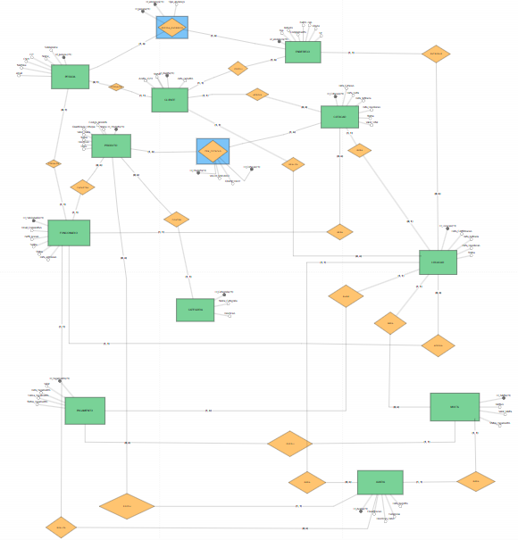

# Projeto ERP — Festa & Cia Locações

Sistema de Locação de Produtos para Festas
Universidade Cidade de São Paulo — UNICID | Modelagem de Banco de Dados
Orientador: Prof. Clóvis Ferraro | São Paulo, 2026

## Identificação da Equipe
| Nome | RGM |
|---|---|
| Ana Carolina Santana dos Santos | 47505249 |
| Cesar Augusto Vivoda Cruz | 49455273 |
| Danilo Gomes | 04933256-2 |
| Érika Gabriela Bueno da Silva | 48836061 |
| Grazielle Pinheiro Barreto | 04940761-9 |
| João Pedro Moreira Dias Pereira | 49067095 |
| Julia Costa de Jesus | 46063978 |
| Lethicia Gomes de Souza | 49700995 |
| Leticia Alarcon Gomes de Lima | 04989967-8 |
| Lucas Moreira Lima | 04928488-6 |

## ETAPA 01 - ESCOLHA E CARACTERIZAÇÃO DA EMPRESA

Qual é o nome da empresa?

  Festa & Cia Locações. 

Qual é o segmento?

  Locação de produtos e equipamentos para festas e eventos em geral. 

O que ela vende ou oferece?

  A empresa não vende produtos físicos; ela realiza a locação. Oferece itens para eventos como: mesas, cadeiras, toalhas, capas, louças, decorações temáticas, tendas, iluminação, pula-pulas, camas elásticas e brinquedos em geral para aniversários, casamentos e eventos corporativos. 

Quem são seus principais clientes?

  ⦁	Pessoas Físicas: clientes que realizam festas de aniversário, casamentos ou confraternizações familiares. 
  ⦁	Pessoas Jurídicas: buffets, decoradores, cerimonialistas e empresas organizadoras de eventos. 

Quais são seus principais setores?

  ⦁	Atendimento / Comercial: responsável por orçamentos, cotações, reservas e geração de contratos. 
  
  ⦁	Estoque / Logística: controla a disponibilidade, separação, saída, transporte e retorno dos itens. 
  
  ⦁	Financeiro: controla pagamentos, recebimentos de sinais, débitos pendentes e cobrança de multas por atraso ou avaria. 

Como funciona atualmente?

  Atualmente, a empresa busca modernizar seu controle operacional por meio de um sistema web integrado com banco de dados relacional. O funcionamento está estruturado da seguinte forma: 

  ⦁	Cadastro: todos os clientes, produtos e usuários são cadastrados e armazenados de forma centralizada no banco de dados.
  
  ⦁	Consulta de Disponibilidade: quando o cliente realiza o acesso ao site, obtém todos os produtos disponíveis em estoque, alguns com disponibilidade sob consulta.
  
  ⦁	Locação: ao confirmar o pedido, o sistema gera o contrato, registra as datas de retirada e devolução, vincula os itens ao cliente e altera o status dos produtos para "locado".
  
  ⦁	Controle de Retorno e Pagamento: na devolução dos produtos, o sistema realiza a baixa no estoque, verifica possíveis avarias e controla o status da quitação financeira.
    
  Toda a operação será integrada, eliminando a duplicidade de informações e a perda de dados ocorridas no controle manual, garantindo agilidade e segurança. 

Quais informações são importantes para o negócio?

  ⦁	Para o cliente: nome/razão social, CPF/CNPJ, telefone, e-mail e endereço completo de entrega. 
  
  ⦁	Para o produto: nome, código (SKU), quantidade em estoque, valor da diária e status (disponível, locado, em manutenção, inutilizado/perda). 
  
  ⦁	Para a locação: data da festa, data/hora de retirada e devolução, lista de itens, valor total, forma de pagamento, comprovantes de sinal e contrato.

## ETAPA 02 - JUSTIFICATIVA DA ESCOLHA

A escolha de uma empresa do ramo de locação de produtos para festas justifica-se por apresentar um cenário ideal para a aplicação prática dos conceitos de Análise de Sistemas e Modelagem de Banco de Dados Relacional:

  ⦁	a) Processos que podem ser analisados:

A empresa possui processos operacionais bem definidos que necessitam de sistematização, tais como: cadastro de clientes, controle quantitativo de estoque, consulta de disponibilidade por data, geração automática de contratos, controle de logística de retirada e devolução, e gestão financeira de multas e recebimentos. 

  ⦁	b) Problemas de organização das informações:

Atualmente, as informações encontram-se descentralizadas e controladas manualmente (via WhatsApp, cadernos e planilhas). Isso gera conflitos de reservas para uma mesma data, perda de histórico de clientes, imprecisão na quantidade real disponível e falta de controle sobre pagamentos pendentes e avarias. 

  ⦁	c) Necessidade de integração:

Existe uma necessidade clara de integração em tempo real entre os setores. O Comercial precisa visualizar o estoque disponível em tempo real; o Estoque deve ser notificado sobre saídas e devoluções programadas; e o Financeiro precisa receber automaticamente os dados de faturamento, sinais e multas.

  ⦁	d) Possibilidade de aplicação de um sistema ERP:

Por possuir setores interdependentes (Comercial, Estoque e Financeiro), a empresa apresenta potencial para aplicação de um sistema ERP modular. Este projeto atuará como o núcleo do sistema, centralizando todas as informações em um banco de dados relacional. 
Diferencial — Setor de Atendimento:

O principal diferencial competitivo da empresa é o atendimento personalizado e consultivo, conduzido pelo Representante Comercial, que acompanha o cliente em toda jornada: 

  ⦁	Antes: atendimento consultivo para entender o perfil do evento, indicando os produtos ideais para o espaço, o estilo da festa e o orçamento disponível. O representante atua como um curador, garantindo a melhor escolha. 

  ⦁	Durante: presença do representante comercial na entrega, realizando pessoalmente o checklist completo dos itens contratados no local da festa. Ele é o responsável por garantir que tudo esteja perfeito, transmitindo segurança e profissionalismo ao cliente.
  
  ⦁	Depois: suporte especializado no retorno, com vistoria detalhada, coleta de evidências fotográficas e contato ativo de pós-venda para feedback. Esse acompanhamento próximo é o que gera confiança, recompra e indicação. 

Mais do que um vendedor, nosso Representante Comercial será um elo de confiança entre a empresa e o cliente.

## ETAPA 03 - IDENTIFICAÇÃO DOS PROCESSOS DE NEGÓCIO

Módulo 0: Administração e Funcionários

  ⦁	Quem participa: Administrador, atendentes e sistema interno. 
  
  ⦁	Início: O administrador acessa o painel restrito para criar usuários, definir perfis e gerenciar privilégios de acesso para cada funcionário.
  
  ⦁	O que acontece: O sistema valida credenciais, permite ajuste de perfis e grava alterações. 
  
  ⦁	Informação gerada: Logs de auditoria, registros de permissão e histórico de acessos. 
  
  ⦁	Resultado: Equipe habilitada e permissões de acesso configuradas. 
  
  ⦁	Exceções: Permissões incorretas (acesso negado), falha de autenticação (bloqueio temporário). 

Módulo 01: Cadastro de Cliente

  ⦁	Quem participa: Cliente, atendente e sistema. 
  
  ⦁	Início: O cliente solicita orçamento e preenche os dados cadastrais. 
  
  ⦁	O que acontece: O sistema valida CPF/CNPJ e e-mail (que devem ser únicos), cadastra o registro com status Ativo e envia confirmação de cadastro. 
  
  ⦁	Informação gerada: Registro do cliente, termo de consentimento LGPD e endereços de entrega. 
  
  ⦁	Resultado: Cliente apto a realizar cotações e contratos. 
  
  ⦁	Exceções: Dados inválidos (solicitação de correção), e-mail não confirmado (cadastro pendente). 

Módulo 02: Login do Cliente

  ⦁	Quem participa: Cliente e sistema de autenticação. 
  
  ⦁	Início: O cliente insere suas credenciais na tela de login. 
  
  ⦁	O que acontece: O sistema valida as credenciais, aplica verificação de dois fatores (2FA) quando necessário e inicia a sessão.
  
  ⦁	Informação gerada: Registro de sessão ativa, log de acesso (IP, data e hora). 
  
  ⦁	Resultado: Cliente autenticado com acesso ao painel de reservas. 
  
  ⦁	Exceções: senha incorreta após 3 tentativas gera bloqueio temporário; conta com débito em aberto tem o acesso bloqueado. 

Módulo 03: Catálogo, Cotação e Locação

  ⦁	Quem participa: Cliente, sistema de catálogo e equipe comercial. 
  
  ⦁	Início: O cliente navega pelo catálogo já visualizando a quantidade disponível de cada item. Itens sem disponibilidade aparecem sinalizados como indisponíveis e não podem ser selecionados. 
  
  ⦁	O que acontece: O sistema verifica disponibilidade, gera a cotação (validade de 48h) e, após o pagamento do sinal de 50%, converte em locação e reserva o estoque. 
  
  ⦁	Informação gerada: Cotação, contrato de locação, baixa lógica no estoque e comprovante financeiro. 
  
  ⦁	Resultado: Cotação gerada e locação confirmada. 
  
  ⦁	Exceções: Produto indisponível para a data, expiração do prazo da cotação sem pagamento de sinal. 

Módulo 04: Produtos e Estoque

  ⦁	Quem participa: Equipe de estoque/logística e sistema. 
  
  ⦁	Início: Entrada, saída, devolução ou manutenção de produtos. 
  
  ⦁	O que acontece: O sistema atualiza saldos, emite alertas de estoque mínimo e gerencia status dos itens (Disponível, Locado, pré-locado, em Manutenção, Inutilizado/Perda). 
  
  ⦁	Informação gerada: Registro de movimentação, laudo de avaria e status do inventário. 
  
  ⦁	Resultado: Estoque atualizado e controlado. 
  
  ⦁	Exceções: Indisponibilidade de item, divergência de inventário. 

Módulo 05: Contrato e Financeiro

  ⦁	Quem participa: Cliente, sistema financeiro e equipe administrativa.

  ⦁	Início: Confirmação da locação pelo cliente.
  
  ⦁	O que acontece: O sistema gera o contrato de locação para assinatura digital, processa o sinal de 50% (Pix, Boleto, Cartão) com emissão de recibo, controla o saldo restante e, após quitação total, emite Nota Fiscal única pelo valor integral.
  
  ⦁	Informação gerada: Contrato assinado, recibo de pagamento e Nota Fiscal.
  
  ⦁	Resultado: Locação formalizada e quitação financeira registrada.
  
  ⦁	Exceções: Sinal não pago em 48h, pagamento não identificado, contrato não assinado.

Módulo 06: Devolução, Avarias e Multas

 ⦁	Quem participa: Cliente, equipe de logística e setor financeiro.

  ⦁	Início: Retorno dos produtos locados.
  
  ⦁	O que acontece: A equipe realiza vistoria com laudo fotográfico. Se houver atraso ou avaria, o sistema aplica multa automaticamente conforme contrato e atualiza o status do item para Em Manutenção ou Inutilizado/Perda.
  
  ⦁	Informação gerada: Termo de devolução, laudo de avaria com evidências e cobrança de multa.
  
  ⦁	Resultado: Equipamento retornado ao estoque como Disponível ou bloqueado para manutenção, pendências financeiras tratadas.
  
  ⦁	Exceções: Atraso na devolução (> 24h), perda total ou produto avariado.

Módulo 07: Relatórios e Dashboard

  ⦁	Quem participa: Administrador, gestores e sistema de BI.

  ⦁	Início: Solicitação de relatórios ou acesso ao dashboard gerencial.
  
  ⦁	O que acontece: O sistema compila dados de locações, financeiro e estoque, exibindo gráficos e indicadores em tempo real.
  
  ⦁	Informação gerada: Relatórios de faturamento, giro de estoque (Curva ABC), inadimplência e taxa de avarias.
  
  ⦁	Resultado: Tomada de decisão fundamentada em dados em tempo real.
  
  ⦁	Exceções: Dados incompletos, falha de integração.

  

## ETAPA 04 - IDENTIFICAÇÃO DOS PROBLEMAS E NECESSIDADES

  ⦁	Problema 1: Controle de reservas via WhatsApp, caderno e planilhas. 
    ⦁	Consequência: Conflito de datas e locação em duplicidade do mesmo item. 
    
  ⦁	Problema 2: Atualização manual de estoque, sem baixa automática. 
    ⦁	Consequência: Quantidades divergentes e reserva de itens sem saldo real.
    
  ⦁	Problema 3: Cadastro de clientes pulverizado em papéis e arquivos soltos. 
    ⦁	Consequência: Duplicidade de registros, perda de histórico e atraso no atendimento. 
    
  ⦁	Problema 4: Falta de comunicação em tempo real entre Comercial, Estoque e Financeiro. 
    ⦁	Consequência: Vendas sem checagem de estoque e atraso na identificação de débitos. 
    
  ⦁	Problema 5: Ausência de registro padronizado de avarias e multas. 
    ⦁	Consequência: Prejuízos financeiros e dificuldade na cobrança de danos. 
    
  ⦁	Problema 6: Gestão de contratos e pagamentos em papel. 
    ⦁	Consequência: Dificuldade no acompanhamento de recebimentos de sinais e emissão de notas fiscais. 
    
  ⦁	Problema 7: Ausência de relatórios consolidados. 
    ⦁	Consequência: Tomada de decisões sem dados confiáveis sobre faturamento e itens mais locados.
  
  ⦁	Problema 8: Falta de controle de privilégios de acesso ao sistema. 
    ⦁	Consequência: Riscos de segurança e alterações indevidas nos registros. 
    
    
Necessidade Principal Identificada:
  A empresa necessita de um sistema único e integrado, baseado em banco de dados relacional, que centralize as informações de clientes, produtos, estoque, cotações, contratos, pagamentos e avarias, permitindo a comunicação em tempo real entre todos os setores.

## ETAPA 05 - LEVANTAMENTO DE REQUISITOS FUNCIONAIS

Módulo 0: Administração e Funcionários

  ⦁	RF01 - Validação de dados: Exigir que CPF e e-mail corporativo sejam únicos no sistema. 
  
  ⦁	RF02 - Recuperação de senha: Permitir redefinição de senha via e-mail ou SMS com autenticação segura. 
  
  ⦁	RF03 - Expiração de sessão: Realizar logout automático por inatividade do usuário. 
  
  ⦁	RF04 - Cadastro de funcionários: Permitir que o Administrador cadastre funcionários com nome, CPF, e-mail corporativo, telefone, perfil e senha provisória de 8 dígitos. 
  
  ⦁	RF05 - Definição de perfil: Configurar perfis de acesso: Admin Master, Comercial/Vendas e Estoque/Logística. 
  
  ⦁	RF06 - Controle de status do funcionário: Permitir alterar status para Ativo, Inativo ou Bloqueado. 
  
  ⦁	RF07 - Login do funcionário: Autenticar funcionários e liberar funcionalidades conforme o perfil. 
  
  ⦁	RF08 - Alteração de senha obrigatória: Exigir troca da senha provisória no primeiro login. 
  
  ⦁	RF09 - Auditoria (Logs): Registrar todas as ações dos colaboradores com identificação de nome, data, hora e ação executada.
  
  ⦁	RF10 - Bloqueio automático: Bloquear o acesso do funcionário após 3 tentativas incorretas de login. 

Módulo 01: Cadastro de Clientes

  ⦁	RF01 - Cadastro completo: Permitir inclusão de nome/razão social, CPF/CNPJ, telefone, e-mail e endereço.
  
  ⦁	RF02 - Status padrão: Cadastrar automaticamente o cliente com status Ativo. 
  
  ⦁	RF03 - Validação de documentos: Validar formato e consistência matemática de CPF e CNPJ. 
  
  ⦁	RF04 - Tipo de pessoa: Classificar o cliente como Pessoa Física (PF) ou Pessoa Jurídica (PJ). 
  
  ⦁	RF05 - Validação de contato: Garantir unicidade de e-mail e formato válido para telefones. 
  
  ⦁	RF06 - Busca de endereço por CEP: Preencher logradouro, bairro, cidade e estado automaticamente ao informar o CEP. 
  
  ⦁	RF07 - Múltiplos endereços: Permitir o cadastro de mais de um endereço por cliente para entrega. 
  
  ⦁	RF08 - Restrição de maioridade: Bloquear o cadastro de menores de 18 anos. 
  
  ⦁	RF09 - Termo LGPD: Exigir aceite do termo de consentimento com gravação de data e hora. 
  
  ⦁	RF10 - Edição de cadastro: Permitir alteração exclusiva de telefone, e-mail e endereço. 

Módulo 02: Login do Cliente

  ⦁	RF01 - Criação de credenciais: Permitir cadastro de senha forte com no mínimo 8 caracteres. 
  
  ⦁	RF02 - Autenticação 2FA: Exigir segundo fator de autenticação para acessos (e-mail ou aplicativo). 
  
  ⦁	RF03 - Autenticação de cliente: Permitir login utilizando e-mail ou CPF/CNPJ acompanhado da senha cadastrada. 
  
  ⦁	RF04 - Bloqueio por falhas: Suspender o acesso após 3 tentativas incorretas consecutivas. 
  
  ⦁	RF05 - Redefinição de senha: Enviar link temporário com token seguro para redefinição.
  
  ⦁	RF06 - Registro de conexões: Gravar histórico de logins com IP, data e hora. 
  
  ⦁	RF07 - Encerramento de sessão: Encerrar sessão por inatividade após 15 minutos. 

Módulo 03: Catálogo, Cotação e Locação

  ⦁	RF01 - Exibição do catálogo: Exibir produtos com foto, nome, código, descrição e valor da diária, filtráveis por categoria.
  
  ⦁	RF02 - Carrinho de compras: Permitir adição, alteração de quantidade e remoção de itens. 
  
  ⦁	RF03 - Validação de seleção: Bloquear envio de cotação com o carrinho vazio.
  
  ⦁	RF04 - Registro do período: Exigir data da festa e prazos de retirada e devolução.
  
  ⦁	RF05 - Consulta de disponibilidade: Verificar estoque disponível para a data solicitada. 
  
  ⦁	RF06 - Bloqueio por indisponibilidade: Alertar o cliente caso o produto não tenha saldo para a data escolhida.
  
  ⦁	RF07 - Restrição de cotação: Permitir envio de orçamento apenas para clientes autenticados com status Ativo.
  
  ⦁	RF08 - Emissão de cotação: Gerar cotação detalhada com código, itens, prazos, diárias e valor total.
  
  ⦁	RF09 - Validade do orçamento: Expirar a cotação automaticamente após 48 horas. 
  
  ⦁	RF10 - Notificação de vencimento: Avisar o cliente 24 horas antes da expiração da cotação.
  
  ⦁	RF11 - Análise comercial: Permitir que a equipe Comercial analise, aprove ou recuse orçamentos.
  
  
  ⦁	RF12 - Conversão em locação: Converter cotação em contrato após confirmação e pagamento do sinal de 50%.
  
  ⦁	RF13 - Baixa lógica de estoque: Reservar os itens no estoque para as datas confirmadas. 
  
  ⦁	RF14 - Liberação de reserva: Cancelar a reserva lógica se o sinal não for quitado dentro do prazo.
  
  ⦁	RF15 - Status do cliente: Alterar status para Locado na confirmação e Bloqueado em caso de débitos.
  
  ⦁	RF16 - Consulta pelo cliente: Disponibilizar painel para consulta de cotações e contratos vigentes.
  
  ⦁	RF17 - Regras de cancelamento: Aplicar reembolso proporcional conforme antecedência (100% acima de 48h; 50% entre 24h e 47h; 0% abaixo de 24h).
  
  ⦁	RF18 - Registro do cancelamento: Exigir confirmação do cliente para cancelar contrato.
  
  ⦁	RF19 - Comunicação automática: Enviar notificações e-mail/SMS em cada etapa da locação.
  
  ⦁	RF20 - Auditoria de contrato: Gravar histórico de alterações de cada contrato de locação. 

Módulo 04: Produtos e Estoque

  ⦁	RF01 - Cadastro de produto: Permitir registro com código, nome, quantidade, valor da diária e status.
  
  ⦁	RF02 - Edição de produto: Permitir atualização dos dados cadastrais dos produtos.
  
  ⦁	RF03 - Consulta de saldo: Exibir quantidade total, reservada e disponível de cada item.
  
  ⦁	RF04 - Gestão de estoque: Registrar entradas, saídas, devoluções e manutenções.
  
  ⦁	RF05 - Checagem por data: Consultar disponibilidade considerando a agenda de eventos.
  
  ⦁	RF06 - Reserva de itens: Bloquear saldo de estoque conforme as datas reservadas.
  
  ⦁	RF07 - Baixa automática: Atualizar quantidade disponível na confirmação do contrato.
  
  ⦁	RF08 - Retorno de estoque: Incrementar quantidade disponível na devolução física dos itens.
  
  ⦁	RF09 - Controle de status: Alternar status do item entre Disponível, Locado, Em Manutenção e Inutilizado/Perda.
  
  ⦁	RF10 - Registro de avarias: Permitir lançamento de danos identificados na vistoria.
  
  ⦁	RF11 - Trava de manutenção: Bloquear novas reservas de itens avariados até sua liberação.
  
  ⦁	RF12 - Mídia e descrição: Permitir inclusão de galeria de fotos e ficha descritiva. 
  
  ⦁	RF13 - Alerta de estoque mínimo: Notificar quando o saldo de estoque atingir o limite mínimo configurado. 
  
  ⦁	RF14 - Rastreabilidade: Registrar histórico de movimentações e alterações do estoque. 

Módulo 05: Contrato e Financeiro

  ⦁	RF01 - Emissão automática de contrato: Gerar contrato PDF/digital automaticamente com aceite do sinal. 
  
  ⦁	RF02 - Download de documentos: Permitir download do contrato em PDF, DOC, TXT e PNG. 
  
  ⦁	RF03 - Registro de pagamentos: Armazenar pagamentos efetuados, formas e saldos devedores. 
  
  ⦁	RF04 - Multiplataforma de pagamento: Aceitar Boleto, Pix, Cartão de Crédito e Débito. 
  
  ⦁	RF05 - Emissão de Nota Fiscal: Gerar Nota Fiscal automaticamente após confirmação do pagamento. 
  
  ⦁	RF06 - Consulta de Notas Fiscais: Permitir ao cliente baixar todas as suas Notas Fiscais. 
  
  ⦁	RF07 - Controle de pendências: Apresentar saldos abertos e contas a receber para o Financeiro. 
  
  ⦁	RF08 - Histórico financeiro: Manter histórico de contratos, notas e pagamentos por cliente. 
  
  ⦁	RF09 - Sincronização intersetorial: Atualizar informações financeiras em tempo real para Comercial e Logística.

Módulo 06: Devolução, Avarias e Multas

  ⦁	RF01 - Lançamento de multas: Gerar cobranças automáticas vinculadas à locação por atraso ou danos.
  
  ⦁	RF02 - Multa por atraso: Aplicar taxa para atrasos superiores a 24 horas (1 diária + 10% de multa ao dia).
  
  ⦁	RF03 - Perda total por inadimplência: Cobrar valor de reposição integral do produto após 7 dias de atraso e alterar status do cliente para Bloqueado.
  
  ⦁	RF04 - Classificação de avarias: Permitir classificação dos danos em: Leve (20% da diária), Média (50% do valor de reposição) ou Grave (100% do valor de reposição).
  
  ⦁	RF05 - Laudo com evidências: Exigir descrição, assinatura do vistoriador e mínimo de 2 fotos para liberar cobrança.
  
  ⦁	RF06 - Destinação do produto: Atualizar status do produto avariado com base no laudo.
  
  ⦁	RF07 - Bloqueio e liberação do cliente: Bloquear cliente inadimplente e desbloquear automaticamente após a quitação.
  
  ⦁	RF08 - Baixa definitiva: Dar baixa definitiva no estoque em perdas totais ou avarias graves. 

Módulo 07: Relatórios e Dashboard

  ⦁	RF01 - Visão por perfil: Exibir painéis visuais com indicadores personalizados por perfil.

  ⦁	RF02 - Filtro por período: Permitir filtragem de relatórios por intervalo de datas.
  
  ⦁	RF03 - Relatório financeiro: Gerar demonstrativos de faturamento, recebimentos de sinais e multas.
  
  ⦁	RF04 - Relatório de estoque: Emitir relatórios com posição atual do estoque (disponíveis, alocados e em manutenção).
  
  ⦁	RF05 - Relatório de avarias: Listar laudos, classificações, fotos e valores cobrados.
  
  ⦁	RF06 - Exportação de dados: Permitir exportação de relatórios em PDF, XLSX e CSV.
  
  ⦁	RF07 - Desempenho de cotações: Apresentar taxa de conversão e expiração de orçamentos.
  
  ⦁	RF08 - Curva ABC de estoque: Classificar produtos por frequência de locação e receita gerada.
  
  ⦁	RF09 - Relatório de inadimplência: Listar clientes com débitos pendentes e multas em aberto.
  
  ⦁	RF10 - Romaneio diário: Gerar lista de separação e conferência para logística.
  
  ⦁	RF11 - Perfil do cliente: Exibir histórico de locações anteriores para atendimento personalizado.
  
  ⦁	RF12 - Atualização contínua: Atualizar métricas do dashboard em tempo real.
  
  ⦁	RF13 - Ticket médio: Calcular e exibir o valor médio por locação (faturamento total das locações ÷ número de locações realizadas), com filtro por período.

## ETAPA 06 - REQUISITOS NÃO FUNCIONAIS DO SISTEMA GERAL

 ⦁	RNF01 - Usabilidade: Interface simples, responsiva e intuitiva para clientes e funcionários em dispositivos desktop e mobile.

  ⦁	RNF02 - Segurança: Criptografia de senhas (hash seguro) e autenticação de dois fatores (2FA).
  
  ⦁	RNF03 - Desempenho: Consultas de estoque e geração de cotações em tempo de resposta inferior a 3 segundos.
  
  ⦁	RNF04 - Compatibilidade: Compatibilidade com os navegadores Google Chrome, Microsoft Edge e Mozilla Firefox.
  
  ⦁	RNF05 - Disponibilidade: Disponibilidade de 99,0% do tempo, com rotinas automáticas de backup diário do banco de dados.
  
  ⦁	RNF06 - Padrão de Dados: Utilização de Banco de Dados Relacional MySQL.
  
  ⦁	RNF07 - Linguagem e Arquitetura: Desenvolvimento em PHP + MySQL.

## ETAPA 07 - IDENTIFICAÇÃO DAS REGRAS DE NEGÓCIO DO SISTEMA

Módulo 0: Administração e Funcionários

  ⦁	RN01 - Privilégio do Admin: Apenas usuários com perfil Admin Master podem cadastrar funcionários.

  ⦁	RN02 - Restrição a usuários operacionais: Usuários comuns não possuem permissão para criar novos usuários.
  
  ⦁	RN03 - Campos obrigatórios: Nome completo, CPF (único), e-mail corporativo (único), telefone, cargo e perfil.
  
  ⦁	RN04 - Escopo de permissão:
  
  -	ADMIN MASTER: Acesso total (funcionários, produtos, relatórios e financeiro).
  
  -	COMERCIAL / VENDAS: Elabora cotações, confirma locações e gera contratos; não altera estoque nem exclui produtos.
  
  -	ESTOQUE / LOGÍSTICA: Cadastra e movimenta produtos, emite laudos de avaria; sem acesso ao financeiro detalhado.
  
  ⦁	RN05 - Inativação e histórico: Funcionário inativado perde acesso imediatamente, preservando-se seu histórico para auditoria.
  
  ⦁	RN06 - Primeiro acesso: Obrigatoriedade de alteração da senha provisória no primeiro login.
  
  ⦁	RN07 - Logs de auditoria: Todas as ações devem registrar usuário, data e hora.
  
  ⦁	RN08 - Segregação de telas: Login de funcionários realizado em URL e ambiente totalmente separados do login de clientes.

Módulo 01: Cadastro de Cliente
  ⦁	RN01 - Unicidade cadastral: É vedada a duplicidade de CPF/CNPJ ou e-mail no sistema.

  ⦁	RN02 - Status inicial: O status automático pós-cadastro é Ativo.
  
  ⦁	RN03 - Validação de documento: Validação matemática estrita de CPF (11 dígitos) e CNPJ (14 dígitos).
  
  ⦁	RN04 - Maioridade legal: Cadastro restrito a indivíduos com idade igual ou superior a 18 anos.
  
  ⦁	RN05 - Registro LGPD: Gravação obrigatória do aceite dos termos da LGPD com data e hora.
  
  ⦁	RN06 - Edição de dados: O cliente pode alterar apenas telefone, e-mail e endereços.

Módulo 02: Login do Cliente
 ⦁	RN01 - Pré-requisito: Exige cadastro prévio ativo no banco de dados.

  ⦁	RN02 - Bloqueio temporário: A conta é bloqueada temporariamente após 3 tentativas seguidas de senha incorreta.
  
  ⦁	RN03 - Expiração de sessão: Sessão encerrada automaticamente após 15 minutos sem interação.

Módulo 03: Catálogo, Cotação e Locação
 ⦁	RN01 - Seleção mínima: A cotação exige ao menos 1 produto no carrinho.

  ⦁	RN02 - Validade de orçamento: Cotação válida por 48 horas; expira automaticamente se o sinal não for quitado.

  ⦁	RN03 - Garantia de reserva (Sinal): A reserva de estoque só é efetivada mediante pagamento comprovado do sinal de 50%.

  ⦁	RN04 - Regras de reembolso por cancelamento:
  
  -	Cancelamento com antecedência ≥ 48h: reembolso de 100% do sinal.
  -	
  -	Cancelamento entre 24h e 47h: reembolso de 50% do sinal.
  -	
  -	Cancelamento < 24h: sem direito a reembolso do sinal.

Módulo 04: Produtos e Estoque

  ⦁	RN01 - Atributos do produto: Todo produto deve conter código (SKU), nome, valor da diária e quantidade em estoque. 
  
  ⦁	RN02 - Status do produto: Os estados possíveis são Disponível, Locado, Em Manutenção ou Inutilizado/Perda. 
  
  ⦁	RN03 - Trava por manutenção: Itens com avaria média vão para Em Manutenção e são bloqueados para locação. 

Módulo 05: Contrato e Financeiro

  ⦁	RN01 - Vínculo contratual: Contrato gerado automaticamente a partir da cotação aprovada com sinal quitado. 
  
 ⦁	RN02 - Quitação na retirada: O saldo restante de 50% deve ser quitado até a data da retirada dos produtos. 

 
  Módulo 06: Devolução, Avarias e Multas
  
  ⦁	RN01 - Tolerância no atraso: Tolerância de até 1 hora no horário de devolução antes da cobrança de multa. 
  
  ⦁	RN02 - Cálculo de multa por atraso: Atrasos superiores a 24 horas implicam a cobrança de 1 diária integral + multa de 10%/dia.
  
  ⦁	RN03 - Caracterização de perda: Atrasos superiores a 7 dias convertem-se em cobrança pelo valor integral de reposição e bloqueio do cliente. 
  
  ⦁	RN04 - Laudo com evidências: Cobrança de avarias exige laudo com descrição, assinatura do vistoriador e mínimo de 2 fotos. 

  
  Módulo 07: Relatórios e Dashboard
  
  ⦁	RN01 - Atualização contínua: Os indicadores do dashboard atualizam-se em tempo real a cada transação. 
  
  ⦁	RN02 - Acesso restrito: Relatórios sensíveis (financeiro, inadimplência) só são visíveis para perfis autorizados. 
  
  ⦁	RN03 - Base de cálculo do ticket médio: O cálculo utiliza o atributo valor_total da LOCAÇÃO, considerando somente as locações que efetivamente contribuíram para o faturamento no período analisado.

## ETAPA 08 - IDENTIFICAÇÃO DE RESTRIÇÕES E POLÍTICAS ORGANIZACIONAIS

Restrições

 ⦁	Orçamentárias: Projeto com orçamento limitado, exigindo uso de tecnologias de código aberto (PHP/MySQL).

  ⦁	Prazo: Prazo de conclusão alinhado ao cronograma acadêmico.
  
  ⦁	Recursos Humanos: Equipe técnica reduzida com atribuição clara de funções.
  
  ⦁	Legais e Regulatórias: Conformidade obrigatória com a LGPD (Lei nº 13.709/2018).
  
  Políticas Organizacionais
  
  ⦁	Política de Segurança da Informação: Controle estrito de privilégios, criptografia e rotinas diárias de backup.
  
  ⦁	Política de Qualidade: Vistorias de devolução padronizadas com checklists e registro fotográfico.
  
  ⦁	Política de Ética e Compliance: Regras transparentes de cancelamento, prazos e reembolsos.

## 10. Fluxogramas
.jpg)
.jpg)
.jpg)
.jpg)
.jpg)
.jpeg)
.jpeg)
.jpeg)

## ETAPA 10 - IDENTIFICAÇÃO DAS ENTIDADES

Com base na análise de processos, foram identificadas as seguintes entidades:

  ⦁	PESSOA: Representa a entidade genérica que centraliza os dados comuns a indivíduos no sistema, servindo como supertipo para Cliente e Funcionário a fim de evitar redundância de atributos como nome e CPF.
  
  ⦁	CLIENTE: Dados específicos do contratante que realiza cotações e contratos de locação, vinculado a uma PESSOA.
  
  ⦁	FUNCIONÁRIO: Dados do colaborador interno (Administrador, Comercial e Estoque), vinculado a uma PESSOA.
  
  ⦁	ENDEREÇO: Armazena os endereços de Pessoa (Cliente/Funcionário) e os locais de entrega/retirada da Locação.
  
  ⦁	PESSOA_ENDEREÇO: Entidade associativa entre PESSOA e ENDEREÇO, que registra os vínculos e a finalidade (entrega, cobrança ou comercial) de cada endereço cadastrado.
  
  ⦁	CATEGORIA: Agrupa os produtos do acervo por classe/tipo (ex.: Mobiliário, Brinquedos).
  
  ⦁	PRODUTO: Representa os materiais do inventário disponíveis para locação.
  
  ⦁	COTAÇÃO: Registra os orçamentos solicitados pelos clientes.
  
  ⦁	ITEM_COTAÇÃO: Entidade associativa entre COTAÇÃO e PRODUTO.
  
  ⦁	LOCAÇÃO: Registra os contratos de locação formalizados.
  
  ⦁	PAGAMENTO: Armazena os lançamentos financeiros (sinais, quitações e multas).
  
  ⦁	AVARIA: Registra os laudos de vistoria e evidências de danos na devolução.
  
  ⦁	MULTA: Armazena as penalidades financeiras emitidas por atraso ou avaria.

## ETAPA 11 - IDENTIFICAÇÃO DOS ATRIBUTOS

| Entidade | Principais Atributos |
|----------|----------------------|
| PESSOA | id_pessoa (PK), nome, sobrenome, cpf, cnpj, telefone, email |
| CLIENTE | id_pessoa (FK), status, aceite_lgpd, data_cadastro |
| FUNCIONÁRIO | id_funcionario (PK), email_corporativo, perfil_acesso, senha, status, data_admissao |
| ENDEREÇO | id_endereco (PK), cep, rua, numero, complemento, bairro, cidade, uf |
| PESSOA_ENDEREÇO | id_pessoa (PK/FK), id_endereco (PK/FK), tipo_endereco |
| CATEGORIA | id_categoria (PK), nome_categoria, descricao |
| PRODUTO | id_produto (PK), nome, codigo_produto, quantidade_estoque, valor_diaria, status, descricao, fotos |
| COTAÇÃO | id_cotacao (PK), data_cotacao, data_festa, data_retirada, data_devolucao, status, valor_total |
| ITEM_COTAÇÃO | id_cotacao (PK/FK), id_produto (PK/FK), quantidade, valor_unitario |
| LOCAÇÃO | id_locacao (PK), data_confirmacao, data_retirada, data_devolucao, status, valor_total |
| PAGAMENTO | id_pagamento (PK), valor, data_pagamento, forma_pagamento, tipo, status_pagamento |
| AVARIA | id_avaria (PK), classificacao, descricao_dano, evidencias, data_registro |
| MULTA | id_multa (PK), motivo, valor_multa, status_pagamento |

## ETAPA 12 - IDENTIFICAÇÃO DOS RELACIONAMENTOS

- **PESSOA — CLIENTE:** Uma pessoa pode se cadastrar como cliente ou não.
- **PESSOA — FUNCIONÁRIO:** Uma pessoa pode ser contratada como funcionária da empresa ou não.
- **PESSOA — PESSOA_ENDEREÇO — ENDEREÇO:** Uma pessoa pode ter vários endereços (entrega, cobrança, comercial) e um mesmo endereço pode estar vinculado a mais de uma pessoa; o vínculo é registrado na entidade associativa PESSOA_ENDEREÇO.
- **CLIENTE — COTAÇÃO:** Um cliente solicita orçamentos de locação.
- **CLIENTE — LOCAÇÃO:** Um cliente firma contratos de locação.
- **CATEGORIA — PRODUTO:** Uma categoria agrupa diversos produtos.
- **FUNCIONÁRIO — PRODUTO:** O funcionário cadastra e mantém os produtos do acervo.
- **COTAÇÃO — ITEM_COTAÇÃO — PRODUTO:** A cotação especifica os produtos e quantidades orçadas.
- **COTAÇÃO — LOCAÇÃO:** Uma cotação aprovada origina um contrato de locação.
- **LOCAÇÃO — ENDEREÇO:** A locação vincula-se a um endereço específico de entrega.
- **FUNCIONÁRIO — LOCAÇÃO:** O funcionário comercial aprova e gerencia o contrato.
- **FUNCIONÁRIO — COTAÇÃO:** O funcionário comercial atende e acompanha as cotações solicitadas.
- **LOCAÇÃO — PAGAMENTO:** O contrato gera lançamentos financeiros de sinal e saldo.
- **LOCAÇÃO — AVARIA:** O encerramento do contrato pode originar laudos de avaria.
- **PRODUTO — AVARIA:** O laudo identifica um produto físico específico danificado.
- **AVARIA — MULTA:** Laudos tarifados geram cobranças de multa ao cliente.
- **MULTA — PAGAMENTO:** O pagamento de uma penalidade quita a multa vinculada.
- **FUNCIONÁRIO — AVARIA:** O funcionário da logística assina a vistoria e o laudo de avaria.

## ETAPA 13 - DETERMINAÇÃO DAS CARDINALIDADES

A cardinalidade mínima e máxima de cada um dos vinte relacionamentos binários identificados na ETAPA 12 foi determinada com base nas regras de negócio das ETAPAS 03 a 08, seguindo a notação (mínimo, máximo): 

o mínimo define a participação da entidade — total (1) ou parcial (0) — e o máximo define a multiplicidade do vínculo (1 ou N).

  ⦁	PESSOA (1,1) ↔ (0,1) CLIENTE: A pessoa pode ainda não ter se cadastrado como cliente (0, participação parcial da pessoa) ou possuir no máximo 1 cadastro de cliente. Todo CLIENTE, por outro lado, corresponde a exatamente 1 única pessoa (participação total do cliente), evitando duplicidade de dados cadastrais.
  
  ⦁	PESSOA (1,1) ↔ (0,1) FUNCIONÁRIO: A pessoa pode nunca ter sido contratada pela empresa (0, participação parcial da pessoa) ou possuir no máximo 1 vínculo empregatício ativo. Todo FUNCIONÁRIO, contudo, corresponde a exatamente 1 única pessoa (participação total do funcionário).
  
  ⦁	PESSOA (1,1) ↔ (0,N) PESSOA_ENDEREÇO: Uma pessoa pode não ter nenhum endereço vinculado ainda (0, participação parcial) ou ter N vínculos ao longo do tempo. Cada registro em PESSOA_ENDEREÇO pertence obrigatoriamente a 1 única pessoa (participação total).
  
  ⦁	ENDEREÇO (1,1) ↔ (0,N) PESSOA_ENDEREÇO: Um endereço pode nunca ter sido vinculado (0, participação parcial) ou ser compartilhado por N pessoas diferentes. Cada registro em PESSOA_ENDEREÇO refere-se obrigatoriamente a 1 único endereço (participação total).
  
  ⦁	CLIENTE (1,1) ↔ (0,N) COTAÇÃO: Um cliente recém-cadastrado possui 0 cotações (participação parcial do cliente), podendo realizar N cotações ao longo do tempo. Toda cotação, por sua vez, pertence a exatamente 1 único cliente autenticado (participação total da cotação), impedindo orçamentos órfãos no sistema.
  
  ⦁	CLIENTE (1,1) ↔ (0,N) LOCAÇÃO: Um cliente pode nunca fechar um contrato (0 locações, participação parcial), ou firmar N locações ao longo da relação comercial. Cada locação vincula-se a exatamente 1 único cliente responsável (participação total), permitindo cobrança e histórico individualizados.
  
  ⦁	CATEGORIA (1,1) ↔ (0,N) PRODUTO: Uma categoria pode ser cadastrada sem nenhum produto vinculado ainda (0, participação parcial) ou agrupar N produtos. Todo produto, entretanto, pertence a exatamente 1 categoria (participação total), o que evita itens "soltos" no catálogo.
  
  ⦁	FUNCIONÁRIO (1,1) ↔ (0,N) PRODUTO: Um funcionário pode ainda não ter cadastrado nenhum produto (0, participação parcial) ou cadastrar N produtos no acervo. Todo produto é cadastrado por exatamente 1 funcionário (participação total).
  
  ⦁	COTAÇÃO (1,1) ↔ (1,N) ITEM_COTAÇÃO: Uma cotação deve conter no mínimo 1 produto no carrinho e no máximo N (participação total de ambos os lados). Cada item de cotação pertence a exatamente 1 cotação, não podendo existir de forma independente.
  
  ⦁	PRODUTO (1,1) ↔ (0,N) ITEM_COTAÇÃO: Um produto recém-cadastrado pode nunca ter sido cotado (0, participação parcial do produto) ou constar em N cotações diferentes ao longo do tempo. Cada item de cotação refere-se a exatamente 1 produto específico (participação total).
  
  ⦁	COTAÇÃO (1,1) ↔ (0,1) LOCAÇÃO: Uma cotação pode expirar em 48h sem originar contrato (0 locações, participação parcial da cotação) ou gerar exatamente 1 locação oficial, nunca mais de uma. Toda locação, por outro lado, deriva obrigatoriamente de 1 única cotação aprovada (participação total da locação), preservando o histórico completo da negociação.
  
  ⦁	ENDEREÇO (1,1) ↔ (0,N) LOCAÇÃO: Um endereço cadastrado pode nunca ter sido usado em uma locação (0, participação parcial) ou ser reaproveitado em N contratos diferentes. Toda locação, contudo, vincula-se a exatamente 1 endereço específico de entrega e retirada (participação total).
  
  ⦁	FUNCIONÁRIO (1,1) ↔ (0,N) LOCAÇÃO: Um funcionário comercial pode ainda não ter aprovado nenhum contrato (0, participação parcial) ou gerenciar N locações simultaneamente. Toda locação, entretanto, deve ser aprovada e gerenciada por exatamente 1 funcionário responsável (participação total).
  
  ⦁	FUNCIONÁRIO (1,1) ↔ (0,N) COTAÇÃO: Um funcionário recém-admitido pode ainda não ter atendido nenhuma solicitação (0, participação parcial) ou atender N cotações. Toda cotação registrada no sistema deve estar vinculada a exatamente 1 funcionário responsável pelo atendimento comercial (participação total).
  
  ⦁	LOCAÇÃO (1,1) ↔ (1,N) PAGAMENTO: Para ser considerada ativa e formalizada no sistema, toda locação exige a confirmação de no mínimo 1 lançamento financeiro (como o sinal de 50% ou o pagamento integral à vista), podendo receber N liquidações ao longo do contrato (participação total e multiplicidade N da locação). Por sua vez, cada pagamento vincula-se a exatamente 1 contrato de locação (participação total do pagamento), o que impede transações financeiras órfãs ou divididas entre contratos distintos.
  
  ⦁	LOCAÇÃO (1,1) ↔ (0,N) AVARIA: Uma locação devolvida sem qualquer dano gera 0 avarias (participação parcial da locação); havendo problemas na vistoria, pode gerar N laudos, um para cada item danificado. Toda avaria, contudo, está sempre vinculada a exatamente 1 locação de origem (participação total).
  
  ⦁	PRODUTO (1,1) ↔ (0,N) AVARIA: Um produto pode nunca ter sofrido avaria ao longo de sua vida útil (0, participação parcial) ou acumular N laudos de dano em diferentes locações. Cada laudo de avaria, entretanto, identifica exatamente 1 produto físico específico (participação total).
  
  ⦁	AVARIA (1,1) ↔ (1,1) MULTA: Todo laudo de avaria classificado como tarifável gera exatamente 1 multa financeira correspondente, e toda multa está sempre associada a exatamente 1 laudo de avaria — participação total e relacionamento estritamente um-para-um em ambos os lados.
  
  ⦁	MULTA (0,1) ↔ (0,N) PAGAMENTO: Um pagamento pode não estar vinculado a nenhuma multa, caso seja referente apenas ao sinal ou ao saldo do contrato (0, participação parcial de ambos os lados), ou estar associado a exatamente 1 multa específica. Uma multa, por sua vez, pode ainda não ter sido quitada (0 pagamentos registrados) ou receber N lançamentos até sua quitação total.
  
  ⦁	FUNCIONÁRIO (1,1) ↔ (0,N) AVARIA: Um funcionário da logística pode ainda não ter assinado nenhum laudo (0, participação parcial) ou assinar N vistorias de avaria ao longo do tempo. Toda avaria, contudo, deve ser assinada por exatamente 1 funcionário responsável pela vistoria (participação total), garantindo a validade jurídica do laudo.

## ETAPA 14 - VERIFICAÇÃO DE RELACIONAMENTOS N:N EXISTENTES

No modelo de negócios, foram identificados dois relacionamentos muitos-para-muitos (N:N): 

  ⦁	COTAÇÃO × PRODUTO: Uma cotação pode possuir diversos produtos e um produto pode figurar em várias cotações. 
  
  ⦁	Solução: Criação da entidade associativa ITEM_COTAÇÃO.
  
  ⦁	PESSOA × ENDEREÇO: Uma pessoa pode ter múltiplos endereços registrados (entrega, cobrança, comercial) e um mesmo endereço pode estar vinculado a mais de uma pessoa.
  
  ⦁	Solução: Criação da entidade associativa PESSOA_ENDEREÇO.

## ETAPA 15 - VERIFICAÇÃO DE RELACIONAMENTOS COM ATRIBUTOS

As entidades associativas criadas passam a armazenar atributos próprios das associações: 

  ⦁	ITEM_COTAÇÃO: Armazena quantidade (unidades do produto cotadas) e valor unitário (valor da diária unitária praticada no orçamento).
  
  ⦁	PESSOA_ENDEREÇO: Armazena tipo de endereço (classificação da finalidade do local vinculado à pessoa, como entrega, cobrança ou comercial).

## ETAPA 16 - ELABORAÇÃO DO DER (DIAGRAMA ENTIDADE-RELACIONAMENTO)
  ### Conceitual

## ETAPA 17 - CONSTRUÇÃO DO DICIONÁRIO DE DADOS CONCEITUAL

**Entidade: PESSOA**

Centraliza os dados cadastrais comuns de identificação (pessoa física ou jurídica), servindo de base para os registros de CLIENTE e FUNCIONÁRIO e evitando duplicidade de nome, documento e contato.

| Nome do Campo | Tipo de Dado | Tamanho/Precisão | Nulo? | Chave | Descrição / Regra de Negócio |
|---|---|---|---|---|---|
| id_pessoa | INT | — | Não | PK | Identificador único da pessoa. Gerado automaticamente (auto incremento). |
| nome | VARCHAR | 50 | Não | — | Primeiro nome da pessoa física ou razão social/nome fantasia da pessoa jurídica. |
| sobrenome | VARCHAR | 50 | Sim | — | Sobrenome da pessoa física. Permanece vazio no caso de pessoa jurídica. |
| cpf | VARCHAR | 14 | Sim | Unique | CPF da pessoa física, validado matematicamente. Obrigatório para pessoa física e nulo para pessoa jurídica. |
| cnpj | VARCHAR | 18 | Sim | Unique | CNPJ da pessoa jurídica, validado matematicamente. Obrigatório para pessoa jurídica e nulo para pessoa física. |
| telefone | VARCHAR | 15 | Não | — | Telefone principal de contato. |
| email | VARCHAR | 100 | Não | Unique | E-mail principal para login e notificações. |

**Entidade: CLIENTE**

Representa pessoas físicas ou jurídicas que realizam cotações e contratam locações de materiais para eventos na plataforma.

| Nome do Campo | Tipo de Dado | Tamanho/Precisão | Nulo? | Chave | Descrição / Regra de Negócio |
|---|---|---|---|---|---|
| id_pessoa | INT | — | Não | FK | Pessoa física ou jurídica correspondente a este cadastro de cliente (PESSOA). |
| id_cliente | INT | — | Não | PK | Identificador único do cliente. Gerado automaticamente (auto incremento). |
| status | ENUM | ('Ativo', 'Locado', 'Bloqueado') | Não | — | Situação cadastral do cliente no sistema. Valor padrão: Ativo. |
| aceite_lgpd | ENUM | 1 | Não | — | Confirmação de consentimento da LGPD. |
| data_cadastro | DATETIME | — | Não | — | Data e hora em que o cadastro do cliente foi realizado. Valor padrão: CURRENT_TIMESTAMP. |

**Entidade: FUNCIONÁRIO**

Armazena as informações dos colaboradores que operam o sistema e gerenciam as áreas comercial, logística e administrativa.

| Nome do Campo | Tipo de Dado | Tamanho/Precisão | Nulo? | Chave | Descrição / Regra de Negócio |
|---|---|---|---|---|---|
| id_pessoa | INT | — | Não | FK | Pessoa física correspondente a este cadastro de funcionário (PESSOA). |
| id_funcionario | INT | — | Não | PK | Identificador único do funcionário. Gerado automaticamente (auto incremento). |
| email_corporativo | VARCHAR | 100 | Não | Unique | E-mail de login corporativo. |
| perfil_acesso | ENUM | ('Admin Master', 'Comercial', 'Estoque') | Não | — | Define a abrangência das permissões do usuário. |
| senha | VARCHAR | 20 | Não | — | Hash da senha de acesso criptografada. |
| status | ENUM | ('Ativo', 'Inativo', 'Bloqueado') | Não | — | Situação de permissão de acesso do colaborador. Valor padrão: Ativo. |
| data_admissao | DATETIME | — | Não | — | Data em que o colaborador foi admitido. |

**Entidade: ENDEREÇO**

Registra os locais físicos cadastrados para pessoas e clientes para entrega e retirada dos produtos locados.

| Nome do Campo | Tipo de Dado | Tamanho/Precisão | Nulo? | Chave | Descrição / Regra de Negócio |
|---|---|---|---|---|---|
| id_endereco | INT | — | Não | PK | Identificador único do endereço. Gerado automaticamente (auto incremento). |
| cep | VARCHAR | 9 | Não | — | Código de Endereçamento Postal. |
| rua | VARCHAR | 60 | Não | — | Rua, avenida, alameda ou praça. |
| numero | VARCHAR | 10 | Não | — | Número do imóvel. |
| complemento | VARCHAR | 50 | Sim | — | Ponto de referência, bloco ou número de apartamento. |
| bairro | VARCHAR | 50 | Não | — | Bairro onde o imóvel está localizado. |
| cidade | VARCHAR | 50 | Não | — | Município de entrega. |
| uf | CHAR | 2 | Não | — | Unidade da Federação (Estado). |

**Entidade ASSOCIATIVA: PESSOA_ENDEREÇO**

Associa pessoas a um ou mais endereços cadastrados, indicando a finalidade de cada vínculo e permitindo que um mesmo endereço seja compartilhado entre pessoas.

| Nome do Campo | Tipo de Dado | Tamanho/Precisão | Nulo? | Chave | Descrição / Regra de Negócio |
|---|---|---|---|---|---|
| id_pessoa | INT | — | Não | PK/FK | Pessoa vinculada ao endereço (PESSOA). |
| id_endereco | INT | — | Não | PK/FK | Endereço associado à pessoa (ENDEREÇO). |
| tipo_endereco | VARCHAR | 20 | Não | — | Finalidade do endereço para a pessoa (ex.: 'Entrega', 'Cobrança', 'Residencial', 'Comercial'). |

**Entidade: CATEGORIA**

Classifica e agrupa os produtos do acervo para estruturar a busca no catálogo.

| Nome do Campo | Tipo de Dado | Tamanho/Precisão | Nulo? | Chave | Descrição / Regra de Negócio |
|---|---|---|---|---|---|
| id_categoria | INT | — | Não | PK | Identificador único da categoria. Gerado automaticamente (auto incremento). |
| nome_categoria | VARCHAR | 100 | Não | Unique | Nome da categoria (ex.: Mobiliário, Brinquedos). |
| descricao | TEXT | — | Sim | — | Detalhamento sobre os tipos de itens contidos. |

**Entidade: PRODUTO**

Cadastra os materiais físicos disponíveis no acervo da empresa para locação em eventos.

| Nome do Campo | Tipo de Dado | Tamanho/Precisão | Nulo? | Chave | Descrição / Regra de Negócio |
|---|---|---|---|---|---|
| id_produto | INT | — | Não | PK | Identificador único do produto. Gerado automaticamente (auto incremento). |
| id_categoria | INT | — | Não | FK | Relaciona o produto à sua categoria (CATEGORIA). |
| id_funcionario | INT | — | Não | FK | Funcionário que cadastrou o produto no acervo (FUNCIONÁRIO). |
| nome | VARCHAR | 150 | Não | — | Denominação comercial do produto. |
| codigo_produto | VARCHAR | 50 | Não | Unique | Código interno/SKU do item. |
| quantidade_estoque | INT | — | Não | — | Quantidade total do item no inventário. Valor padrão: 0. |
| valor_diaria | DECIMAL | 10,2 | Não | — | Preço da diária de locação por unidade. |
| status | ENUM | ('Disponível', 'Pré-locado', 'Locado', 'Em Manutenção', 'Inutilizado/Perda') | Não | — | Situação física e operacional do produto. Valor padrão: Disponível. |
| descricao | TEXT | — | Sim | — | Especificações técnicas e dimensões do produto. |
| fotos | VARCHAR | 255 | Sim | — | Caminho da imagem do item no repositório de mídia. |

**Entidade: COTAÇÃO**

Registra a solicitação de orçamento elaborada pelo cliente contendo as datas desejadas para a festa.

| Nome do Campo | Tipo de Dado | Tamanho/Precisão | Nulo? | Chave | Descrição / Regra de Negócio |
|---|---|---|---|---|---|
| id_cotacao | INT | — | Não | PK | Identificador único da cotação. Gerado automaticamente (auto incremento). |
| id_cliente | INT | — | Não | FK | Identifica o cliente solicitante (CLIENTE). |
| id_funcionario | INT | — | Não | FK | Funcionário responsável pelo atendimento comercial da cotação (FUNCIONÁRIO). |
| data_cotacao | DATETIME | — | Não | — | Data e horário de criação do orçamento. Valor padrão: CURRENT_TIMESTAMP. |
| data_festa | DATE | — | Não | — | Data agendada para a realização do evento. |
| data_retirada | DATETIME | — | Não | — | Data e horário previstos para a entrega/retirada. |
| data_devolucao | DATETIME | — | Não | — | Data e horário previstos para a devolução dos itens. |
| status | ENUM | ('Pendente', 'Aprovada', 'Expirada', 'Recusada') | Não | — | Situação de análise da cotação. Valor padrão: Pendente. |
| valor_total | DECIMAL | 10,2 | Não | — | Soma dos valores das diárias dos itens selecionados. Valor padrão: 0.00. |

**Entidade ASSOCIATIVA: ITEM_COTAÇÃO**

Associa as entidades COTAÇÃO e PRODUTO, registrando a quantidade de itens solicitados em um orçamento específico.

| Nome do Campo | Tipo de Dado | Tamanho/Precisão | Nulo? | Chave | Descrição / Regra de Negócio |
|---|---|---|---|---|---|
| id_cotacao | INT | — | Não | PK/FK | Código da cotação (COTAÇÃO). |
| id_produto | INT | — | Não | PK/FK | Código do produto selecionado (PRODUTO). |
| quantidade | INT | — | Não | — | Quantidade de unidades cotadas do produto. |
| valor_unitario | DECIMAL | 10,2 | Não | — | Valor da diária unitária praticada na cotação. |

**Entidade: LOCAÇÃO**

Representa o contrato de locação formalizado entre a empresa e o cliente.

| Nome do Campo | Tipo de Dado | Tamanho/Precisão | Nulo? | Chave | Descrição / Regra de Negócio |
|---|---|---|---|---|---|
| id_locacao | INT | — | Não | PK | Identificador único do contrato de locação. Gerado automaticamente (auto incremento). |
| id_cotacao | INT | — | Não | FK (Unique) | Cotação de origem que gerou o contrato (COTAÇÃO). |
| id_cliente | INT | — | Não | FK | Cliente responsável pelo contrato (CLIENTE). |
| id_funcionario | INT | — | Não | FK | Atendente responsável pela aprovação (FUNCIONÁRIO). |
| id_endereco | INT | — | Não | FK | Endereço onde os materiais serão entregues (ENDEREÇO). |
| data_confirmacao | DATETIME | — | Não | — | Data de pagamento do sinal e efetivação da locação. Valor padrão: CURRENT_TIMESTAMP. |
| data_retirada | DATETIME | — | Não | — | Data e horário confirmados para saída dos itens. |
| data_devolucao | DATETIME | — | Não | — | Data e horário limites para retorno dos produtos. |
| status | ENUM | ('Ativa', 'Concluida', 'Cancelada') | Não | — | Situação atual da locação no fluxo operacional. Valor padrão: Ativa. |
| valor_total | DECIMAL | 10,2 | Não | — | Valor total negociado para o contrato. |

**Entidade: PAGAMENTO**

Registra os fluxos financeiros de recebimento vinculados a um contrato de locação (sinal, quitação e multas).

| Nome do Campo | Tipo de Dado | Tamanho/Precisão | Nulo? | Chave | Descrição / Regra de Negócio |
|---|---|---|---|---|---|
| id_pagamento | INT | — | Não | PK | Identificador único do lançamento de pagamento. Gerado automaticamente (auto incremento). |
| id_locacao | INT | — | Não | FK | Contrato de locação associado (LOCAÇÃO). |
| id_multa | INT | — | Sim | FK | Multa associada, caso o pagamento o seja de cobrança extra (MULTA). |
| valor | DECIMAL | 10,2 | Não | — | Quantia financeira paga na transação. |
| data_pagamento | DATETIME | — | Não | — | Data e horário em que o pagamento foi processado. Valor padrão: CURRENT_TIMESTAMP. |
| forma_pagamento | ENUM | ('Boleto', 'Pix', 'Cartão de Crédito', 'Cartão de Débito') | Não | — | Meio financeiro empregado na quitação. |
| tipo | ENUM | ('Sinal', 'Saldo', 'Multa') | Não | — | Natureza do recebimento efetuado. |
| status_pagamento | ENUM | ('Pendente', 'Aprovado', 'Recusado') | Não | — | Status do processamento junto à adquirente/banco. Valor padrão: Pendente. |

**Entidade: AVARIA**

Registra laudos técnicos e evidências de danos identificados em materiais durante a conferência de devolução.

| Nome do Campo | Tipo de Dado | Tamanho/Precisão | Nulo? | Chave | Descrição / Regra de Negócio |
|---|---|---|---|---|---|
| id_avaria | INT | — | Não | PK | Identificador único do laudo de avaria. Gerado automaticamente (auto incremento). |
| id_locacao | INT | — | Não | FK | Contrato correspondente à devolução (LOCAÇÃO). |
| id_produto | INT | — | Não | FK | Produto específico danificado (PRODUTO). |
| id_funcionario | INT | — | Não | FK | Colaborador da logística que realizou a vistoria (FUNCIONÁRIO). |
| classificacao | ENUM | ('Leve', 'Média', 'Grave') | Não | — | Nível de gravidade apurado no laudo. |
| descricao_dano | TEXT | — | Não | — | Detalhamento dos estragos constatados. |
| evidencias | VARCHAR | 255 | Não | — | Link ou caminho do repositório contendo as fotos comprobatórias. |
| data_registro | DATETIME | — | Não | — | Data e hora em que a vistoria foi lançada. Valor padrão: CURRENT_TIMESTAMP. |

**Entidade: MULTA**

Registra a emissão de cobranças financeiras decorrentes de atrasos na devolução ou laudos de avarias.

| Nome do Campo | Tipo de Dado | Tamanho/Precisão | Nulo? | Chave | Descrição / Regra de Negócio |
|---|---|---|---|---|---|
| id_multa | INT | — | Não | PK | Identificador único do registro de multa. Gerado automaticamente (auto incremento). |
| id_locacao | INT | — | Não | FK | Contrato de locação associado à cobrança (LOCAÇÃO). |
| id_avaria | INT | — | Sim | FK | Laudo de avaria de origem (caso o motivo seja dano) (AVARIA). |
| motivo | ENUM | ('Atraso', 'Avaria', 'Perda Total') | Não | — | Razão que motivou a penalidade. |
| valor_multa | DECIMAL | 10,2 | Não | — | Valor monetário a ser cobrado do cliente. |
| status_pagamento | ENUM | ('Pendente', 'Quitada') | Não | — | Situação de quitação do débito pelo cliente. Valor padrão: Pendente. |

**17.2 Classificação das Entidades Quanto à Dependência de Existência**

Seguindo o critério de dependência de existência/identificação estudado em aula, cada entidade do modelo foi classificada como forte, fraca ou associativa. É importante destacar que o uso de uma chave substituta (id_com auto incremento) não torna uma entidade forte automaticamente: a chave substituta é apenas uma conveniência técnica de indexação, enquanto a dependência semântica em relação à entidade proprietária permanece a mesma.

| Entidade | Classificação | Depende de | Justificativa |
|---|---|---|---|
| PESSOA | Forte | — | Possui identificação própria (id_pessoa) e é cadastrada de forma independente, comuns os dados cadastrais de onde partem os registros de CLIENTE e FUNCIONÁRIO. |
| CLIENTE | Forte | — | Possui identificação própria (id_cliente) e existe como cadastro independente, a FK só possui apenas referência de dados cadastrais comuns. |
| FUNCIONARIO | Forte | — | Possui identificação própria (id_funcionario) e é cadastrado de forma independente, a FK só possui apenas referência de dados cadastrais comuns. |
| ENDERECO | Forte | — | Possui identificação própria (id_endereco) e é cadastrado de forma independente, o mesmo endereço pode ser compartilhado por várias pessoas, sem que sua entidade associativa PESSOA_ENDERECO, sem pertencer a um cliente. |
| PESSOA_ENDERECO | Associativa | PESSOA e ENDERECO | Tabela associativa do relacionamento N:N entre PESSOA e ENDERECO, sua PK é composta pelos FKs e possui o id_endereco como identificador do vínculo. |
| CATEGORIA | Forte | — | Existe de forma independente, servindo como classificação. Sua existência semântica não depende de nenhum produto estar cadastrado. |
| PRODUTO | Forte | — | Possui identificação própria (id_produto) e possui independente do aluguel e/ou cotação ou locação; o relacionamento com CATEGORIA é uma classificação, não uma dependência de existência. |
| COTACAO | Forte | — | Um orçamento é um objeto de negócio com identidade própria, mesmo se dependente de um cliente para ser gerado — a entidade forte não significa entidade sem relacionamentos. |
| ITEM_COTACAO | Associativa | COTACAO e PRODUTO | Associativa do relacionamento N:N entre COTACAO e PRODUTO; sua PK é composta pelos FKs das duas entidades, sem vida própria, com uso de chave substituta. |
| LOCACAO | Forte | — | O contrato de locação possui identidade própria e centraliza as informações de cobrança, laudos e relações; independente das outras entidades (fraca identificação). |
| PAGAMENTO | Fraca | LOCACAO | Um lançamento financeiro só faz sentido vinculado a um contrato específico; fora do contexto da locação, o registro perde seu significado de negócio. |
| AVARIA | Fraca | LOCACAO | Um laudo de avaria é sempre consequência de uma locação específica; sem ela, não existe o conceito de "dano" com um contexto de devolução. |
| MULTA | Fraca | AVARIA | A multa é gerada exclusivamente a partir da classificação de uma avaria (relacionamento 1:1, participação total); não há multa sem o laudo que a originou. |

ETAPA 18 - JUSTIFICATIVA DAS PRINCIPAIS DECISÕES

⦁	Adoção do Sistema Gerenciador de Banco de Dados Relacional (SGBD MySQL):

A escolha do MySQL fundamenta-se na necessidade de assegurar as propriedades ACID (Atomicidade, Consistência, Isolamento e Durabilidade), garantindo a integridade transacional dos contratos, pagamentos e controle rigoroso de saldo de estoque em tempo real. 

⦁	Criação da Entidade Associativa (ITEM_COTAÇÃO):

A decomposição do relacionamento N:N entre COTAÇÃO e PRODUTO, por meio da entidade ITEM_COTAÇÃO, eliminou redundâncias de dados e possibilitou o armazenamento individualizado de quantidades e valores unitários das diárias praticadas em cada orçamento. Como toda LOCAÇÃO deriva de exatamente 1 COTAÇÃO aprovada (relacionamento 1:1), os mesmos registros de ITEM_COTAÇÃO também representam os itens confirmados do contrato de locação, dispensando uma segunda tabela de itens e evitando duplicidade de dados entre a fase de orçamento e a fase de contrato.

⦁	Gerenciamento de Estados via Tipos Enumerados (ENUM):

O uso de tipos ENUM para os status de clientes (Ativo, Locado, Bloqueado), produtos (Disponível, Pré-locado, Locado, Em Manutenção, Inutilizado/Perda) e cotações evita a inserção de valores inválidos e simplifica as regras de transição operacional no sistema. 

⦁	Exigência de Laudo com Fotos para Lançamento de Avarias:

A obrigatoriedade de vincular no mínimo duas imagens comprobatórias e a assinatura do funcionário aos laudos de avaria assegura fundamentação técnica e transparência jurídica para a cobrança das multas, reduzindo disputas comerciais com clientes. 

⦁	Exigência do Sinal de 50% para Efetivação da Reserva:

A regra de negócio que condiciona a conversão da cotação em locação ao pagamento do sinal de 50% garante o compromisso financeiro do cliente e evita o bloqueio indevido do estoque por reservas especulativas não confirmadas. 

⦁	Criação da Entidade PESSOA (Generalização/Especialização):

CLIENTE e FUNCIONÁRIO compartilhavam os mesmos dados de identificação (nome, documento, e-mail e telefone), o que gerava duplicidade de estrutura no modelo. A entidade PESSOA foi criada como generalização desses dados comuns, com CLIENTE e FUNCIONÁRIO passando a se especializar dela por meio de uma chave estrangeira (id_pessoa). Essa decisão mantém CLIENTE e FUNCIONÁRIO com identificação própria (id_cliente e id_funcionario), guardando neles apenas os dados específicos de cada papel, elimina a repetição de atributos e permite que, futuramente, uma mesma pessoa venha a acumular os dois papéis sem duplicar seus dados cadastrais.

⦁	Criação da Entidade Associativa PESSOA_ENDEREÇO:

Uma pessoa pode ter vários endereços (entrega, cobrança, comercial) e um mesmo endereço pode ser usado por mais de uma pessoa, como membros da mesma família ou de uma mesma empresa. Esse relacionamento N:N foi resolvido pela entidade associativa PESSOA_ENDEREÇO, com chave primária composta (id_pessoa, id_endereco) e o atributo tipo_endereco, que classifica a finalidade de cada vínculo, evitando o cadastro repetido do mesmo local.

ANEXO A - GESTÃO DE ORÇAMENTO, CAIXA E TICKET MÉDIO

Este anexo complementa as ETAPAS 05, 07 e 17, descrevendo em linguagem corrida como os requisitos e as regras financeiras já definidos (Módulos 03, 05, 06 e 07) se conectam na rotina da empresa, a partir das entidades COTAÇÃO, LOCAÇÃO, PAGAMENTO, AVARIA e MULTA. Nada do que foi definido nas etapas anteriores é alterado: o texto apenas explica e relaciona o que já consta no trabalho.

A.1 Gestão de Orçamento e Caixa

Cuidar do dinheiro da empresa vai muito além de registrar pagamentos. É importante saber quanto a empresa tem para receber, quais locações já foram pagas, quais clientes ainda possuem valores pendentes e quais cobranças surgiram após a devolução dos produtos.
Por isso, a gestão de orçamento e caixa será integrada ao sistema de locações. Dessa forma, quando um cliente solicitar um orçamento, o sistema já registra o valor total da contratação (atributo valor_total da COTAÇÃO) e acompanha todo o caminho financeiro até o encerramento da locação.

Como funciona na prática

Tudo começa com o orçamento. O cliente escolhe os produtos que precisa para sua festa, informa a data do evento e recebe uma cotação com os itens, quantidades, valores e valor total. Essa cotação fica disponível por 48 horas (Módulo 03 – RN02) e, para que a reserva seja realmente confirmada, o cliente precisa realizar o pagamento de um sinal correspondente a 50% do valor da locação (Módulo 03 – RN03).

Depois que o sinal é identificado, o sistema transforma o orçamento em uma locação confirmada (Módulo 05 – RN01) e registra esse recebimento no financeiro, como um lançamento da entidade PAGAMENTO vinculado à LOCAÇÃO. O restante dos 50% deve ser pago até a retirada dos produtos (Módulo 05 – RN02). Assim, a empresa consegue visualizar com facilidade o que já entrou no caixa e o que ainda precisa ser recebido.

Controle do caixa

O caixa deve apresentar de forma simples os valores que entram e os valores que ainda estão previstos para entrar. Entre os principais recebimentos estão:

⦁	sinais de 50% das locações;

⦁	pagamentos dos saldos restantes;

⦁	valores de multas por atraso;

⦁	cobranças relacionadas a avarias ou perda de produtos;

⦁	outros recebimentos vinculados aos contratos.

Cada pagamento deve ficar relacionado à respectiva locação, permitindo consultar o valor, a data, a forma de pagamento e o status da quitação, informações que correspondem aos campos valor, data_pagamento, forma_pagamento e status_pagamento da entidade PAGAMENTO. O sistema também deve manter o histórico financeiro de cada cliente.

Além disso, o sistema permite trabalhar com diferentes formas de pagamento, como Pix, boleto e cartão. Isso facilita a rotina do cliente e, ao mesmo tempo, evita que a equipe precise procurar comprovantes em diferentes lugares.

Acompanhamento do que ainda falta receber

Um dos pontos mais importantes para o controle do caixa é não olhar somente para aquilo que já foi pago. A empresa também precisa saber o que está pendente.

Por exemplo, se uma locação custa R$ 1.000,00, o sistema registra o recebimento inicial de R$ 500,00 e deixa os outros R$ 500,00 como saldo pendente até que o cliente faça a quitação.

Valor da locação → Sinal recebido → Saldo pendente → Pagamento final → Situação da locação.

Essa sequência corresponde ao valor_total da LOCAÇÃO, aos lançamentos de PAGAMENTO dos tipos Sinal e Saldo e ao status da locação (Ativa, Concluída ou Cancelada).

Controle de multas e avarias

A gestão financeira também continua depois da festa. Quando os produtos retornam, a equipe realiza uma vistoria. Caso exista atraso ou algum produto tenha sido danificado, a ocorrência pode gerar uma cobrança adicional.

O sistema registra a avaria, o laudo, as evidências e a multa correspondente (entidades AVARIA e MULTA, relacionadas na proporção 1:1 conforme a ETAPA 13). Em caso de atraso superior a 24 horas, por exemplo, existe uma regra definida no projeto para cobrança de uma diária integral mais 10% de multa ao dia (Módulo 06 – RN02). Já situações de perda possuem uma regra específica de cobrança pelo valor de reposição (Módulo 06 – RN03).

Visão do orçamento da empresa

Além de controlar o dinheiro recebido dos clientes, a gestão de orçamento deve ajudar a empresa a entender sua própria situação financeira.

O gestor poderá acompanhar os valores previstos e realizados, observando:

  ⦁	quanto foi faturado com as locações;
  
  ⦁	quanto já foi recebido;
  
  ⦁	quanto ainda está em aberto;
  
  ⦁	quanto entrou por meio de multas;
  
  ⦁	quais contratos estão pendentes;
  
  ⦁	quais períodos tiveram maior movimentação financeira;
  
  ⦁	quais produtos geram maior receita.

Com essas informações organizadas no sistema, o financeiro deixa de depender de anotações espalhadas em WhatsApp, cadernos e planilhas e passa a fazer parte de uma visão integrada de toda a empresa. Essa integração atende diretamente a um dos principais problemas identificados no projeto e é apoiada pelos relatórios do Módulo 07 (RF02 – filtro por período, RF03 – relatório financeiro, RF08 – curva ABC e RF09 – inadimplência).

A.2 Ticket Médio

O ticket médio é um indicador que ajuda a entender, de forma simples, quanto cada cliente costuma gastar, em média, em uma locação.

Como a empresa trabalha com diferentes tipos de produtos e cada festa possui necessidades diferentes, o valor de uma locação pode variar bastante. Um cliente pode contratar apenas mesas e cadeiras, enquanto outro pode precisar de uma estrutura mais completa, com toalhas, louças, decoração, brinquedos, iluminação e outros itens.

Ticket Médio = Faturamento total das locações ÷ Número de locações realizadas

Por exemplo, se em determinado período realizarmos 10 locações e faturarmos R$ 10.000,00, o ticket médio será de R$ 1.000,00 por locação.

Esse indicador permite que a empresa tenha uma visão mais clara do seu desempenho comercial. Em vez de olhar somente para o faturamento total, a gestão consegue perceber quanto cada contrato representa, em média, para o negócio.

O ticket médio também pode ser analisado junto com os dados do orçamento e do caixa. Como o projeto estabelece que a locação é confirmada após o pagamento de um sinal de 50%, uma contratação de R$ 1.000,00 gera inicialmente R$ 500,00 recebidos e outros R$ 500,00 previstos para pagamento até a retirada dos produtos.

Além disso, acompanhar o ticket médio ao longo do tempo pode nos ajudar a perceber mudanças no comportamento dos clientes. Se o valor médio das locações aumentar, a empresa poderá investigar quais produtos ou combinações de produtos estão contribuindo para esse crescimento. Da mesma forma, se o ticket médio diminuir, será possível analisar se os clientes estão realizando eventos menores ou escolhendo opções de menor valor.

Assim, o ticket médio deixa de ser apenas um número e passa a ser uma ferramenta para compreender melhor as vendas, os clientes e a movimentação financeira.

No sistema, o ticket médio é um indicador calculado, e não um campo armazenado em tabela: utiliza o atributo valor_total da entidade LOCAÇÃO, considerando somente as locações que efetivamente contribuíram para o faturamento no período analisado, e é exibido no relatório e no dashboard financeiro (Módulo 07 – RF03 e RF13, com a regra RN03).

## 👥 Colaboradores

Agradecimento especial a todos que contribuíram para este projeto:

**Grupo 2:**
- **JOÃO PEDRO MOREIRA DIAS PEREIRA** - [LinkedIn](https://www.linkedin.com/in/joao-moreira-a38734215) | [GitHub](https://github.com/moreirajoao17-max)
- **GRAZIELLE PINHEIRO BARRETO** - [LinkedIn](https://www.linkedin.com/in/grazielle-pinheiro-4b0bb793) | [GitHub](https://github.com/GraziellePinheiro)
- **LUCAS MOREIRA LIMA** - [LinkedIn](https://www.linkedin.com/in/lucas-moreira-7134b2437) | [GitHub](https://github.com/LucMLima640)
- **JULIA COSTA DE JESUS** - [GitHub](https://github.com/juliacostadejesus-stack)
- **LETÍCIA ALARCON GOMES DE LIMA** - [LinkedIn](https://www.linkedin.com/in/leti-alarc-834a64436) | [GitHub](https://github.com/letialarc-cmyk)
- **ANA CAROLINA SANTANA DOS SANTOS** - [LinkedIn](https://www.linkedin.com/in/ana-carolina-santana-dos-santos-7850a1316/) | [GitHub](https://github.com/anacsantos-tech)
- **CESAR AUGUSTO VIVODA CRUZ** - [LinkedIn](https://www.linkedin.com/in/cesar-vivoda-a66209208) | [GitHub](https://github.com/Vivoda81)
- **DANILO GOMES** - [LinkedIn](https://www.linkedin.com/in/danilo-gomes-739554437/) | [GitHub](https://github.com/danilodevfullstack07)
- **ÉRIKA GABRIELA BUENO DA SILVA** - [LinkedIn](http://www.linkedin.com/in/erika-gabriela-bueno-da-silva-66b695237) | [GitHub](https://github.com/Erikasilva23)
- **LETHICIA GOMES DE SOUZA** - [LinkedIn](https://www.linkedin.com/in/lethícia-gomes-038a81436/) | [GitHub](https://github.com/lezlls)
